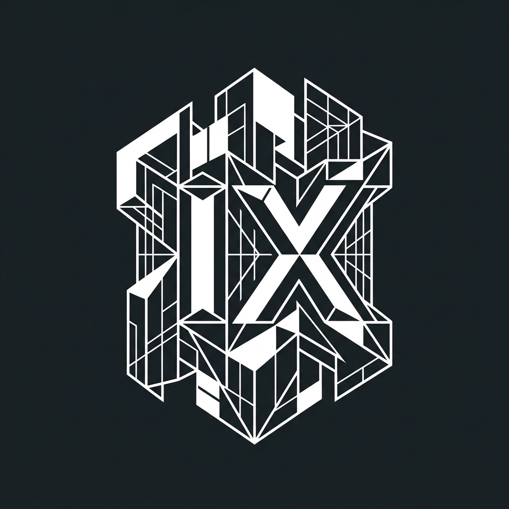

<p align="center">
  
</p>

# IdeaXCoder: Agentic AI Technical Architect

**IdeaXCoder** is a sophisticated agentic AI coding interface designed to transform abstract project ideas into structured technical specifications. Built with a modern Next.js frontend and a powerful FastAPI/LangGraph backend, it orchestrates complex workflows involving research, architectural planning, and human-in-the-loop refinement.

---

## ✨ Features

- **Agentic Workflow:** Powered by [LangGraph](https://www.langchain.com/langgraph), coordinating multiple specialized agents.
- **Deep Research:** Integrates Web Search and Wikipedia agents to gather context and technical requirements.
- **Human-in-the-Loop:** Interactive feedback cycles to ensure the generated architecture aligns perfectly with your vision.
- **Local LLM Integration:** Optimized for [Ollama](https://ollama.com/), giving you full control over your privacy and model selection.
- **Modern UI/UX:** A premium, "Digital Sculptor" inspired interface featuring 3D visuals and monochromatic brutalist aesthetics.

---

## 🚀 Tech Stack

### Frontend
- **Framework:** [Next.js](https://nextjs.org) (App Router)
- **Styling:** Vanilla CSS (Glassmorphism & Brutalist aesthetics)
- **Animations:** [Framer Motion](https://www.framer.com/motion/)
- **3D Visuals:** [React Three Fiber](https://docs.pmnd.rs/react-three-fiber)

### Backend
- **Framework:** [FastAPI](https://fastapi.tiangolo.com/)
- **Orchestration:** [LangGraph](https://www.langchain.com/langgraph)
- **Intelligence:** [Ollama](https://ollama.com/) (Local LLMs)
- **Search Agents:** DuckDuckGo & Wikipedia integrations

---

## 🧠 Project Documentation

For detailed rules and agent-specific contexts, please review:

- [Agents Guidelines](AGENTS.md) - Workflow and state management logic.
- [Gemini Context](GEMINI.md) - Coding standards and tech stack requirements.
- [Claude Context](CLAUDE.md) - UI design principles and project goals.

---

## 💻 Step-by-Step Setup

Follow these steps to configure and run the full IdeaXCoder ecosystem.

### 1. Prerequisites

- **Node.js**: (Version 18+ recommended)
- **Python**: (Version 3.10+ recommended)
- **Ollama**: [Download & Install](https://ollama.com/).
  ```bash
  ollama pull nemotron-mini:latest  # Or your preferred model
  ```

### 2. Environment Configuration

Create the following environment files in the **root project directory**:

#### `.env` (Backend Configuration)
```env
OLLAMA_MODEL="nemotron-mini:latest"
```

#### `.env.local` (Frontend Configuration)
```env
NEXT_PUBLIC_API_URL=http://localhost:8000
```

### 3. Backend Setup

The backend handles the agentic logic and API requests.

1. Open a terminal in the root directory.
2. Initialize and activate the virtual environment:
   ```bash
   # Windows:
   .\venv\Scripts\activate
   # Mac/Linux:
   source venv/bin/activate
   ```
3. Install dependencies:
   ```bash
   pip install -r requirements.txt
   ```
4. Start the FastAPI server:
   ```bash
   uvicorn backend.main:app --reload --port 8000
   ```

### 4. Frontend Setup

The frontend provides the interactive 3D command center.

1. Open a **new** terminal in the root directory.
2. Install Node dependencies:
   ```bash
   npm install
   ```
3. Start the development server:
   ```bash
   npm run dev
   ```

### 5. Verify Installation

- **Frontend:** Visit [http://localhost:3000](http://localhost:3000)
- **Backend API:** Visit [http://localhost:8000/docs](http://localhost:8000/docs) (Swagger UI)

---

## 🎨 Branding & Identity

IdeaXCoder follows a **Digital Sculptor** aesthetic—monochromatic, structured, and premium.

| Asset | Description | Path |
| :--- | :--- | :--- |
| **Logo** | Structural representation of AI architecture. | `public/logo.png` |
| **Favicon** | Geometric minimalist symbol. | `src/app/favicon.ico` |

---

## 🌐 API & Orchestration

The system uses a stateful graph to manage context. Every interaction is validated via Pydantic models, ensuring that the transition from a simple idea to a full technical specification is rigorous and consistent.

